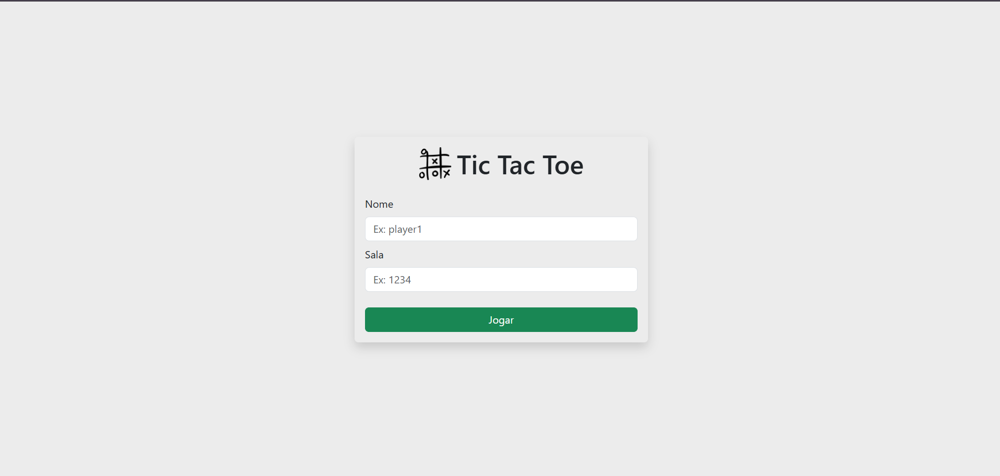
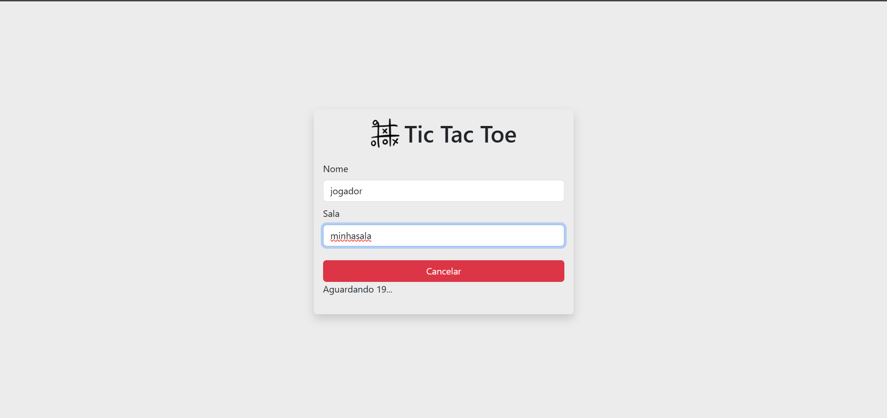
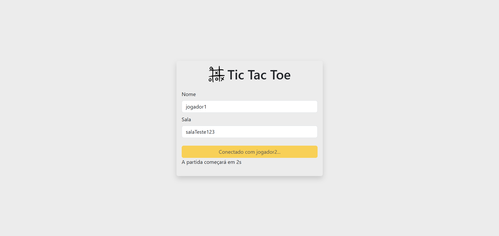
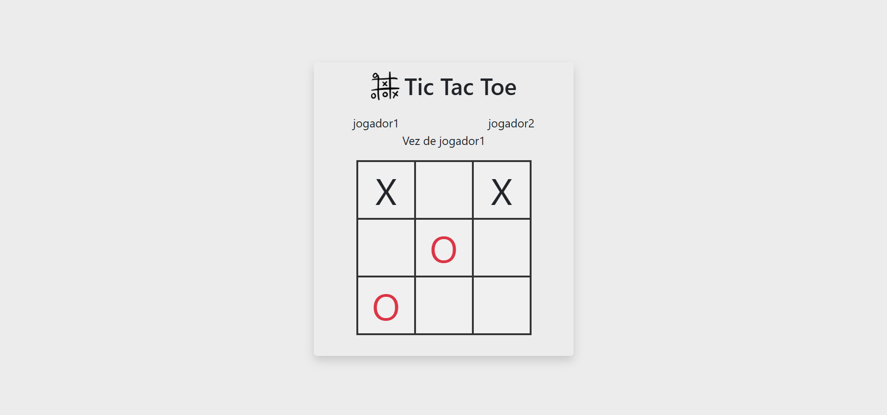

# Tic Tac Toe - Multiplayer

Este projeto é um jogo da velha, com versão multiplayer, desenvolvido com Node.js que configura um servidor Express com comunicação em tempo real usando Socket.io.


## Tecnologias Utilizadas

- NodeJs
- ExpressJs
- Socket.io

## Como funciona?

- **Inserindo Dados**

   O jogador irá iniciar com a seguinte página:
      

   Aqui o jogador deverá inserir seu nome e o nome da sala para jogar. O sistema aguardará 20 segundos para encontrar uma conexão para esta sala.
   
   
   Caso não encontre-a, removerá a sala.
   
- **Encontrou adversário**

   Após achar um adversário na mesma sala, o jogo começará!
   

- **Partida Iniciada**
   
   
   A partida sempre iniciará com o criador da sala!

   Após o térmmino, os jogadores poderão continuar jogando!

## Instalação

1. Clone o repositório:
   ```
   git clone https://github.com/hick-hpe# Tic Tac Toe - Multiplayer

Este projeto é um jogo da velha, com versão multiplayer, desenvolvido com Node.js que configura um servidor Express com comunicação em tempo real usando Socket.io.


## Tecnologias Utilizadas

- NodeJs
- ExpressJs
- Socket.io

## Como funciona?

- **Inserindo Dados**

   O jogador irá iniciar com a seguinte página:
      

   Aqui o jogador deverá inserir seu nome e o nome da sala para jogar. O sistema aguardará 20 segundos para encontrar uma conexão para esta sala.
   
   
   Caso não encontre-a, removerá a sala.
   
- **Encontrou adversário**

   Após achar um adversário na mesma sala, o jogo começará!
   

- **Partida Iniciada**
   
   
   A partida sempre iniciará com o criador da sala!

   Após o término, os jogadores poderão continuar jogando, clicando em `Reiniciar`!

## Instalação

1. Clone o repositório:
   ```
   git clone https://github.com/hick-hpe/tic-tac-toe
   cd tic-tac-toe
   ```

2. Instale as dependências:
   ```
   npm install
   ```

## Uso

Para iniciar o servidor, execute o seguinte comando:
```
npm start
```

O servidor estará rodando em [http://localhost:3000/](http://localhost:3000/).

## Nota(rodando localmente)

Para que outros dispositivos se conectem, devem acessar pelo ip da máquina host. <br/> Por exemplo, se o ip da máquina host é `192.168.3.27`, o link de acesso ao servidor será [http://192.168.3.27:3000/](http://192.168.3.27:3000/).


